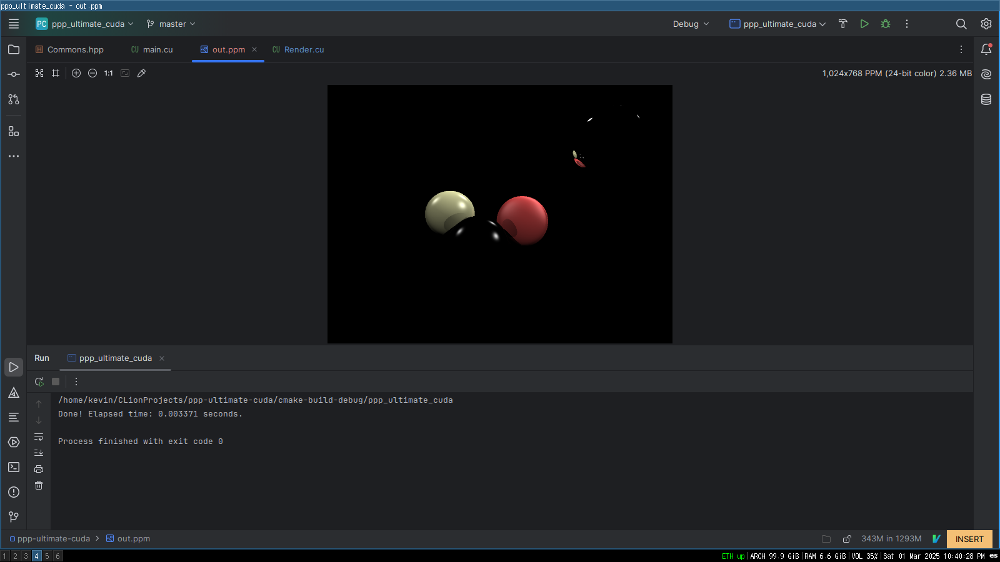

# Raytracer (Multithreading Project)

A simple, multithreaded raytracer, featuring global ilumination, shadows and reflections.

This raytracer uses the nVidia CUDA library, using the power of the GPU to sharply improve rendering times.

## Build

This project uses the CUDA library to take advantage of the GPU. This means you need to have a CUDA-compatible GPU
and the CUDA library installed on your computer.

```
$ mkdir build && cd build
$ cmake ..
$ make
```

## Results




Speedup: 0.514627/0.003366=152.88
